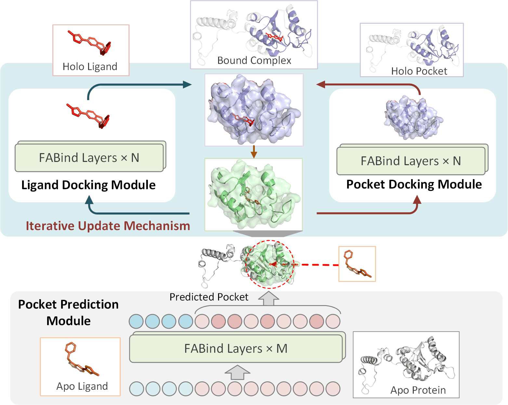

## Fast and Accurate Blind Flexible Docking 
Official code for paper "Fast and Accurate Blind Flexible Docking" (ICLR 2025).

### Illustration:
<div style="text-align: center;">
  
</div>

### Overview:  
```
|---baselines       # directory about the data of baselines
|---binddataset     # directory of the preprocessed dataset
|---ckpt            # directory to store the trained ckpts
|---fabflex         # codes about the FABFlex model
|   |---inference.py    # run entire inference of FABFlex on test sets
|   |---inference_post_optim.py     # run inference with post-optimization
|   |---inference_protein.py        # run inference to output protein
|   |---inference_without_post_optim.py     # run inference without post-optimization
|   |---main_fatwo_joint.py         # training for model
|   |---main_pro_joint.py           # pretraining for pocket docking module
|---requirements.txt    # environment file
```

### How to make inference using FABFlex:
1. download the datasets.
2. download the ckpt from <a href="https://drive.google.com/drive/folders/1WXhDX1wuYrvtwwEZyZakAy5lxpNcQ0A5?usp=sharing" class="underline" target="_blank">Google Drive</a>
3. install the environment
4. run `fabflex/inference.py` as follows:
```
python fabflex/inference.py \
    --batch_size 4 \
    --root_path ./binddataset \
    --use_iterative --total_iterative 6 \
    --pocket_radius 20 --force_fix_radius --min_pocket_radius 20 \
    --n_iter 1 --mean_layers 5 --coord_scale 5 \
    --addNoise 0 --hidden_size 512 \
    --pocket_pred_hidden_size 128 \
    --geometry_reg_step_size 0.001 --geometry_reg_step 1 \
    --use_ln_mlp --rm_layernorm --mlp_hidden_scale 1 --stage 2
    --ckpt $CKPT_PATH
```
If you want to inference with post-optimization, run `fabflex/inference_post_optim.py` as follows:
```
python fabflex/inference_post_optim.py \
    --batch_size 1 \
    --root_path ./binddataset \
    --use_iterative --total_iterative 6 \
    --pocket_radius 20 --force_fix_radius --min_pocket_radius 20 \
    --n_iter 1 --mean_layers 5 --coord_scale 5 \
    --addNoise 0 --hidden_size 512 \
    --pocket_pred_hidden_size 128 \
    --geometry_reg_step_size 0.001 --geometry_reg_step 1 \
    --use_ln_mlp --rm_layernorm --mlp_hidden_scale 1 --stage 2
    --ckpt $CKPT_PATH
    --out_path $OUT_PATH
```

### How to retrain FABFlex from scratch
Before joint training the whole FABFlex model, you need to introduce a two-stage pretraining process to warm up the model, which is important for later joint training. 
1. Pretrain the "pocket prediction module + ligand docking module" under rigid docking conditions: using (holo protein, apo ligand) to predict the holo ligand structure. Here, we use the checkpoint provided by FABind+, which is named as `pretrain_pocket_ligand_docking.bin` in the shared Google Drive. If you want to retrain this model, you can refer to the code in <a href="https://github.com/QizhiPei/FABind" class="underline" target="_blank">FABind+</a>
2. Pretrain the "pocket docking module" using (apo pocket, holo ligand) to predict the holo pocket structure. The trained checkpoint is provided in the shared Google Drive, named as `protein_ckpt.bin`. Run `main_pro_joint.py` as follows:
```
accelerate launch fabflex/main_pro_joint.py \
    --batch_size 2 --root_path ./binddataset --ckpt $ckpt_path \
    --pocket_radius 20 --min_pocket_radius 20 --pocket_radius_buffer 5 \
    --resultFolder $resultFolder \
    --seed 224 --cut_train_set --pocket_flag 1 \
    --protein_epochs 600 \
    --exp_name ${EXP_NAME} --total_iterative 4 \
    --coord_loss_weight 1.5 \
    --pro_loss_weight 1.5 \
    --pair_distance_loss_weight 1.0 \
    --pair_distance_distill_loss_weight 1.0 \
    --pocket_cls_loss_weight 1.0 \
    --pocket_distance_loss_weight 0.05 \
    --pocket_radius_loss_weight 0.05 \
    --lr 5e-5 --lr_scheduler poly_decay \
    --pocket_pred_layers 1 --pocket_pred_n_iter 1 \
    --n_iter 8 --mean_layers 5 \
    --coord_scale 5 --addNoise 0 \
    --hidden_size 512 --pocket_pred_hidden_size 128 \
    --geometry_reg_step_size 0.001 --geometry_reg_step 1 \
    --clip_grad --use_ln_mlp --rm_layernorm \
    --dropout 0.1 \
    --disable_validate --mlp_hidden_scale 1 \
    --wandb --disable_tqdm --wodm --wopr
```

3. Joint train FABFlex model using (apo protein, apo ligand) to predict the structures of (holo pocket, holo ligand). The trained checkpoint is provided in the shared Google Drive, named as `FABFlex_model.bin`. Run `main_fatwo_joint.py` as follows:
```
accelerate launch fabflex/main_fatwo_joint.py \
    --batch_size 2 --root_path ./binddataset \
    --ckpt ./ckpt/pretrain_pocket_ligand_docking.bin --ckpt_protein ./ckpt/protein_ckpt.bin --copy_two 2 \
    --pocket_radius 20 --min_pocket_radius 20 --pocket_radius_buffer 5 \
    --resultFolder $resultFolder \
    --seed 224 --cut_train_set --warmup_epochs 0 --weight_decay 0 \
    --joint_epochs 600 \
    --exp_name ${EXP_NAME} --total_iterative 6 \
    --coord_loss_weight 1.5 \
    --pro_loss_weight 15.0 \
    --pair_distance_loss_weight 1.0 \
    --pair_distance_distill_loss_weight 1.0 \
    --pocket_cls_loss_weight 1.0 \
    --pocket_distance_loss_weight 0.05 \
    --pocket_radius_loss_weight 0.05 \
    --lr 5e-6 --lr_scheduler poly_decay --gradient_accumulate_step 1 \
    --pocket_pred_layers 1 --pocket_pred_n_iter 1 \
    --n_iter 1 --mean_layers 5 \
    --coord_scale 5 --addNoise 0 \
    --hidden_size 512 --pocket_pred_hidden_size 128 \
    --geometry_reg_step_size 0.001 --geometry_reg_step 1 \
    --clip_grad --use_ln_mlp --rm_layernorm \
    --dropout 0.1 \
    --disable_validate --mlp_hidden_scale 1 \
    --disable_tqdm --use_iterative --wodm --wopr \
    --force_fix_radius --stage 2 \
    --wandb
```


### TODO  
- [x] [Code] Clean all related codes
- [x] [Code] Release inference codes of FABFlex
- [x] [Dataset] Upload preprocessed datasets, it is approximately 22.8 GB
- [x] [Ckpt] Upload checkpoint
- [x] [Readme] Write a README


